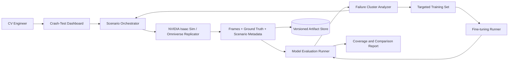

# Physical AI Crash-Test Lab — Product, Research, and Build Plan

## 1. Executive definition

**Theme:** Physical AI with NVIDIA Omniverse  
**Working category:** Scenario-driven validation and targeted remediation for physical AI  
**One-line pitch:** Physical AI Crash-Test Lab discovers where a perception model fails, generates controlled synthetic edge cases, and produces reproducible safety-coverage evidence.

### Critical positioning

Synthetic-data generation and simulation-validation platforms already exist. “We made synthetic warehouse images” is not a sufficiently distinctive product. The prototype must show a closed and measurable loop:

> Define requirement → generate controlled scenarios → evaluate model → identify weak scenario clusters → generate targeted data → improve or retest → issue versioned evidence.

## 2. Problem

Physical AI systems operate in environments where rare failures matter. Real-world collection often underrepresents unusual lighting, occlusion, camera placement, reflective surfaces, clutter, or uncommon worker behavior. It can be unsafe or expensive to stage hazardous conditions, and manually labeled data may not capture all required ground truth.

Simulation can create controlled variations and exact labels, but teams still need to know:

- which scenarios were tested;
- which conditions caused failures;
- whether generated data addressed those failures;
- whether a model version improved on a fixed test suite;
- what remains untested.

The product turns simulation from a content generator into an evidence-driven validation workflow.

## 3. Target market

### Initial customer

Warehouse operators or manufacturers deploying computer vision for PPE compliance and worker safety.

### Economic buyers

- Vice President of Operations
- Head of Environmental Health and Safety
- Head of Robotics or Automation
- Manufacturing technology leader
- Computer-vision platform leader

### Daily users

- Computer-vision engineer
- Simulation engineer
- ML validation engineer
- Safety program analyst
- Site deployment engineer

### Expansion markets

- Manufacturing quality inspection
- Logistics and material handling
- Robotics perception
- Construction safety
- Mining
- Autonomous vehicles and mobile machines

The hackathon must remain focused on warehouse helmet detection.

## 4. Jobs to be done

- “Find the conditions where my perception model is least reliable.”
- “Test hazardous or rare scenarios without staging them physically.”
- “Generate training data for specific failure modes rather than random volume.”
- “Compare model versions on the same scenario suite.”
- “Give safety and engineering teams understandable coverage evidence.”

## 5. Product outcome

The prototype should demonstrate:

- a versioned scenario suite;
- controlled parameter variation;
- ground-truth annotation from simulation;
- model predictions over generated frames;
- performance grouped by scenario condition;
- identification of weak scenario clusters;
- targeted generation for one failure cluster;
- before-and-after or baseline-versus-candidate comparison;
- an evidence report with limitations.

## 6. MVP user journey

1. Engineer selects “Warehouse Helmet Detection” and a baseline model.
2. The system displays the scenario matrix.
3. Omniverse/Isaac Sim generates or loads frames with ground-truth labels.
4. The evaluator runs the model against the fixed suite.
5. A dashboard shows performance by lighting, occlusion, distance, and camera angle.
6. The system identifies the weakest condition, such as low light plus partial occlusion.
7. The engineer requests targeted synthetic data for that cluster.
8. The generator creates additional training frames.
9. A candidate model is trained or selected.
10. Both model versions are evaluated against the unchanged test suite.
11. The system generates a safety-coverage report showing improvement and unresolved gaps.

## 7. Scope decision

### Primary task

Detect whether a warehouse worker is wearing a hard hat.

### Objects

- worker/person;
- hard hat;
- optional pallet or warehouse distractor.

### Scenario variables

Implement three or four:

- lighting level;
- camera elevation or angle;
- worker distance;
- helmet occlusion;
- background clutter.

Do not attempt weather, multiple sensor modalities, robot control, full-body pose, and factory digital twins in the same prototype.

## 8. Scenario specification

Represent every generated frame with explicit metadata:

```json
{
  "scenario_suite": "warehouse_ppe_v1",
  "scenario_id": "ppe-lowlight-occluded-042",
  "seed": 42,
  "lighting_lux_bucket": "low",
  "camera_angle_bucket": "high_oblique",
  "distance_m_bucket": "6_to_10",
  "helmet_occlusion": "partial",
  "background_clutter": "high",
  "expected_objects": ["person", "hard_hat"],
  "generator_version": "replicator_script_commit",
  "asset_manifest_version": "assets_v1"
}
```

The report must retain seeds and versions so a scenario can be reproduced.

## 9. Test-suite design

### Fixed evaluation suite

- Split scenario seeds into training and test sets.
- Never train on the fixed test frames.
- Keep the test-suite distribution unchanged when comparing models.
- Define condition buckets before looking at results.
- Use enough samples per bucket to avoid meaningless one-frame conclusions.

### Targeted remediation set

- Select the weakest predeclared condition bucket.
- Generate new frames with different seeds but the same condition.
- Add adjacent conditions to reduce overfitting to one exact configuration.
- Train or fine-tune only on the training/remediation set.

### Metrics

For object detection:

- precision;
- recall;
- F1 at a declared confidence/IoU threshold;
- mAP if the implementation and sample size support it;
- false-negative rate, especially for “helmet missing” or “helmet present” safety interpretation;
- performance by scenario bucket;
- confidence intervals for proportion metrics where sample size permits.

Report sample count beside every scenario metric. Any sim-to-real claim requires a separate real-world holdout that was not used for training. Do not claim safety certification.

## 10. Improvement claim

The strongest demo compares:

- `Baseline model` evaluated on fixed suite;
- `Candidate model` trained with targeted synthetic data;
- both evaluated on the same unchanged test suite.

If retraining is unstable or exceeds the sprint:

- compare an existing baseline and candidate model;
- or demonstrate failure discovery and targeted dataset generation without claiming improvement.

A truthful partial loop is better than fabricated performance.

## 11. Proposed architecture



## 12. Recommended technical stack

### Simulation

- NVIDIA Isaac Sim/Omniverse version supported by available hardware
- Replicator Python API
- OpenUSD scene
- SimReady assets where licensing and availability permit
- RGB images plus 2D bounding boxes and scenario metadata

### Model pipeline

- Python
- PyTorch
- A small object detector already understood by the team
- COCO-compatible labels if convenient
- Fixed evaluation script

### Application

- FastAPI or a simple Python service
- Streamlit or React dashboard
- SQLite/JSON metadata for the prototype
- Local filesystem for images, labels, predictions, and reports

### Reproducibility

- pinned environment;
- GPU and driver details;
- fixed seeds;
- model hash;
- scenario-suite version;
- asset manifest;
- dataset manifest;
- evaluation configuration.

## 13. Prerequisites and go/no-go gate

This idea must pass the following gate before selection, subject to hackathon rules:

- A supported RTX-capable NVIDIA GPU with adequate RAM, VRAM, storage, and compatible drivers is reserved.
- The current supported Isaac Sim release launches reliably. Research on August 6, 2026 identified Isaac Sim 6.0 as current; recheck before installation.
- A minimal scene renders.
- Replicator produces RGB and bounding-box output.
- The model inference environment works.
- One complete generated frame reaches the evaluator.
- Assets and models have acceptable licenses.
- The team knows whether pre-event environment setup is allowed.

If rules prohibit prebuilt project work, only validate general tooling to the degree explicitly permitted. Ask the organizers. Never conceal pre-event work.

If the pipeline cannot be proven within the allowed preparation rules, choose AI Data Passport.

## 14. Asset plan

Required:

- one warehouse environment;
- one or a few worker assets;
- hard-hat asset;
- simple distractors;
- one camera;
- lights.

Track:

- asset source;
- license;
- version;
- modifications;
- semantic labels.

Avoid spending the sprint creating high-quality 3D art. Visual polish should come from lighting, camera framing, and a clear dashboard.

## 15. Data flow

1. Scenario orchestrator reads suite definition.
2. Replicator applies parameter values and seed.
3. Simulator renders frame and ground truth.
4. Exporter writes image, labels, and metadata atomically.
5. Evaluator runs model inference.
6. Matcher compares prediction and ground truth.
7. Metrics are aggregated globally and by scenario bucket.
8. Failure analyzer ranks weak conditions with sample counts.
9. Targeted generator creates additional training scenarios.
10. Candidate model is evaluated on the original fixed suite.
11. Reporter records evidence and limitations.

## 16. API or command sketch

- `POST /suites` — register a scenario suite
- `POST /runs` — start generation or evaluation run
- `GET /runs/{id}` — retrieve status and manifest
- `POST /runs/{id}/evaluate` — evaluate a model
- `GET /runs/{id}/failures` — retrieve weak scenario clusters
- `POST /remediation-datasets` — create targeted generation request
- `POST /models` — register model hash and metadata
- `GET /comparisons/{id}` — compare model versions
- `GET /reports/{id}` — export coverage report

For the hackathon, command-line generation plus dashboard ingestion may be more reliable than synchronous simulation through a web request.

## 17. Dashboard design

### Screen 1: Scenario Suite

- requirement;
- model version;
- scenario factors;
- sample counts;
- run status.

### Screen 2: Failure Map

- overall metrics;
- condition buckets;
- sample counts;
- representative false positives/negatives;
- weakest cluster.

### Screen 3: Remediation

- targeted parameters;
- generated training examples;
- dataset manifest;
- candidate model status.

### Screen 4: Comparison Report

- baseline versus candidate on fixed suite;
- improved and regressed conditions;
- unresolved gaps;
- versions, seeds, and limitations.

Avoid a dashboard full of decorative charts. One heatmap-like condition matrix and several representative images may communicate more than many metrics.

## 18. Demo storyboard

### Opening

“A helmet detector passes normal warehouse tests, but the dangerous failures live in conditions the team rarely captured.”

### Live workflow

1. Show normal frame and apparently successful baseline.
2. Start or load the fixed scenario suite.
3. Rapidly show controlled variations.
4. Display ground-truth boxes and predictions.
5. Reveal poor recall for low-light, partially occluded helmets.
6. Inspect representative failure frames.
7. Generate a targeted remediation set.
8. Show baseline and candidate on the unchanged test suite.
9. Highlight measured improvement and any regression.
10. Export the versioned coverage report.

### The “judge moment”

The product discovers a failure the normal demo concealed, then proves whether targeted synthetic data fixed it.

## 19. Success metrics

### Prototype engineering metrics

- Every frame has scenario metadata and a seed.
- Every result references a model and suite version.
- Metrics are reproducible from saved artifacts.
- At least three scenario dimensions are evaluated.
- The seeded weak condition is detected.
- Baseline and candidate are compared on an unchanged test set.
- All reported metrics include sample count and method.

### Customer-value hypotheses to validate

- Reduced time and cost to reproduce rare conditions.
- Higher test coverage before site deployment.
- Faster diagnosis of perception failures.
- Less waste from untargeted synthetic-data generation.
- Better evidence for deployment review.

Do not claim reduced injuries or certified safety without real studies.

## 20. Safety and ethical boundaries

- This prototype does not certify a system as safe.
- Simulation coverage does not prove real-world performance.
- Synthetic-to-real domain gap must be stated.
- A visual PPE system can create surveillance and worker-trust concerns.
- False positives and false negatives have different operational consequences.
- Human safety procedures must not depend solely on the prototype.
- Report excluded scenarios and simulator limitations.
- Use licensed assets and models.

Recommended wording:

> “The report documents performance on a defined simulated scenario suite. It supports engineering review and does not replace real-world validation or a qualified safety assessment.”

## 21. Test strategy

### Unit tests

- scenario-schema validation;
- deterministic seed mapping;
- manifest generation;
- bounding-box conversion;
- prediction/ground-truth matching;
- metric aggregation;
- condition-bucket grouping;
- model and suite version propagation.

### Integration tests

- one scenario renders and exports correctly;
- batch manifest contains all expected artifacts;
- evaluator processes a fixture dataset without simulator access;
- weak seeded condition is ranked correctly;
- targeted generator receives correct parameters;
- comparison uses identical test manifest;
- report values match evaluator output.

### Resilience strategy

- Pre-render a small fixture suite within allowed rules.
- Separate simulator execution from dashboard.
- Allow dashboard to replay saved run artifacts.
- Keep a CPU-compatible inference fallback if possible.
- Record simulator footage early.
- Preserve generated frames and reports after every successful run.

## 22. MVP and non-goals

### Must build

- one warehouse scene;
- one PPE detection requirement;
- three scenario factors;
- generated frames and ground truth;
- model inference;
- condition-level failure analysis;
- targeted generation request;
- fixed-suite comparison or honest baseline report;
- versioned evidence report;
- replayable saved demo.

### Build only if stable

- fine-tune candidate model;
- live simulation triggered from UI;
- fourth scenario factor;
- automated representative-frame selection;
- video sequence.

### Do not build in 22 hours

- photorealistic factory digital twin;
- robot-control policy;
- multi-sensor fusion;
- real-time production deployment;
- universal scenario language;
- safety certification;
- large-scale cloud rendering;
- multiple industrial use cases.

## 23. 22-hour implementation plan

### Hours 0–2

- Confirm environment, scene, model, assets, and rules.
- Freeze scenario schema and fixed evaluation manifest.
- Verify one frame through the pipeline.

### Hours 2–7

- Build Replicator scenario generator.
- Export images, labels, and metadata.
- Generate the initial fixed suite.

### Hours 7–11

- Build model inference, matching, and condition metrics.
- Add tests using saved fixtures.
- Identify weak scenario cluster.

### Hours 11–15

- Build failure-analysis dashboard.
- Implement targeted scenario request and generation.

### Hours 15–18

- Fine-tune or register candidate model if stable.
- Run fixed-suite comparison.
- Generate evidence report.

### Hours 18–22

- Freeze artifacts, validate replay mode, finish README, record, and submit.

## 24. Roadmap

### First 30 days

- Interview one warehouse operator and one CV team.
- Integrate a real customer model and anonymized failure taxonomy.
- Add real-world sample comparison.
- Formalize scenario-suite ownership and review.

### Days 31–90

- Add active failure-cluster selection.
- Add more sensors and domain-gap analysis.
- Integrate model registry and CI.
- Build site-specific scene and camera configuration.

### Days 91–180

- Add distributed simulation.
- Add requirement traceability and approval workflow.
- Add continuous real-to-sim failure ingestion.
- Validate correlation between simulated and real-world metrics.
- Build industry-specific scenario libraries.

## 25. Competitive landscape

Relevant categories include:

- NVIDIA Omniverse, Isaac Sim, Replicator, and Cosmos ecosystem
- Applied Intuition
- Parallel Domain
- Scale AI physical-AI data offerings
- Voxel51 and data-quality/curation platforms
- Siemens and industrial digital-twin platforms
- autonomous-system simulation and validation vendors

The competitive message:

- NVIDIA provides core simulation and synthetic-data infrastructure.
- Large platforms provide broad validation and data flywheels.
- The proposed wedge is an accessible, domain-specific **failure-to-targeted-data-to-evidence loop** for industrial perception, deployable as a Presidio solution accelerator.

Do not claim that broad competitors lack closed-loop validation. Position the hackathon result as a focused accelerator and integration pattern.

## 26. Presidio GTM

### Land

Offer a **Physical AI Validation Readiness Assessment**:

- select one perception requirement;
- review real-world data gaps;
- define scenario taxonomy and metrics;
- evaluate simulator, GPU, model, and MLOps readiness;
- deliver pilot plan and target architecture.

### Expand

- build customer-specific simulation environment;
- integrate real and synthetic datasets;
- create scenario suites and test automation;
- connect model registry, CI/CD, and deployment review;
- optimize NVIDIA infrastructure.

### Operate

- managed scenario-library maintenance;
- recurring model-version validation;
- synthetic-data generation;
- GPU platform operations;
- coverage and evidence reporting.

### Value model

Use:

- cost and time to collect rare real-world conditions;
- annotation cost;
- number of site deployments;
- frequency of model releases;
- engineering time reproducing failures;
- cost of failed deployment tests.

Avoid unsupported injury-reduction or regulatory-savings claims.

## 27. Judging alignment

- **Engineering excellence:** Reproducible simulation manifests, model evaluation, condition analysis, and versioned evidence.
- **Creativity:** Turns synthetic generation into a crash-test and remediation loop.
- **Viability:** Narrow PPE scenario is achievable only with proven tooling and strict scope.
- **GTM:** Clear manufacturing/logistics entry offer and substantial NVIDIA/cloud services path.
- **Vision:** Continuous simulation validation integrated into every physical-AI model release.

## 28. Research questions

- What pre-event environment or asset preparation do hackathon rules allow?
- Which NVIDIA environment and GPU will be available?
- Which warehouse safety requirement is most commercially relevant?
- What real failure modes do PPE models encounter?
- How should simulated coverage correlate with real-world acceptance tests?
- Which customer models and data formats must be supported?
- Which metrics do safety and engineering stakeholders trust?
- What asset and model licenses permit demonstration and commercialization?
- Which existing platforms already address the proposed closed loop?

## 29. Sources to verify before submission

- NVIDIA, Omniverse Replicator announcement: https://nvidianews.nvidia.com/news/nvidia-announces-omniverse-replicator-synthetic-data-generation-engine-for-training-ais
- NVIDIA Isaac Sim, synthetic-data generation with Replicator: https://docs.nvidia.com/learning/physical-ai/getting-started-with-isaac-sim/latest/synthetic-data-generation-for-perception-model-training-in-isaac-sim/04-generating-a-synthetic-dataset-using-a-replicator.html
- NVIDIA Isaac Sim documentation: https://docs.isaacsim.omniverse.nvidia.com/
- NVIDIA Omniverse documentation: https://docs.omniverse.nvidia.com/
- NVIDIA OpenUSD resources: https://developer.nvidia.com/usd
- Applied Intuition, Physical AI simulation, verification, and validation: https://www.appliedintuition.com/physical-ai
- Voxel51, physical AI resources: https://voxel51.com/blog/
- NVIDIA Isaac Sim 6.0 release notes: https://docs.isaacsim.omniverse.nvidia.com/6.0.0/overview/release_notes.html
- NVIDIA TAO Toolkit overview: https://docs.nvidia.com/tao/tao-toolkit/latest/text/overview.html
- NVIDIA Halos Outside-In Safety blueprint: https://docs.nvidia.com/halos-outside-in/latest/index.html
- NVIDIA Omniverse licensing: https://docs.omniverse.nvidia.com/ov/latest/common/NVIDIA_Omniverse_License_Agreement.html
- OSHA warehousing and distribution National Emphasis Program: https://www.osha.gov/sites/default/files/enforcement/directives/CPL-03-00-026.pdf
- OSHA 29 CFR 1910.132 PPE requirements: https://www.osha.gov/laws-regs/regulations/standardnumber/1910/1910.132
- NIST AI Risk Management Framework: https://nvlpubs.nist.gov/nistpubs/ai/NIST.AI.100-1.pdf
- Presidio P.A.T.H. AI Technology Hub: https://www.presidio.com/news/presidio-launches-new-ai-technology-hub-to-spark-enterprise-innovation-and-transformation/

Recheck current NVIDIA versions, hardware requirements, licensing, asset availability, and APIs before implementation. Do not rely on an installation guide for a different Isaac Sim release.
