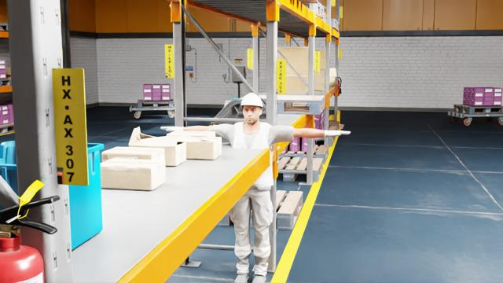
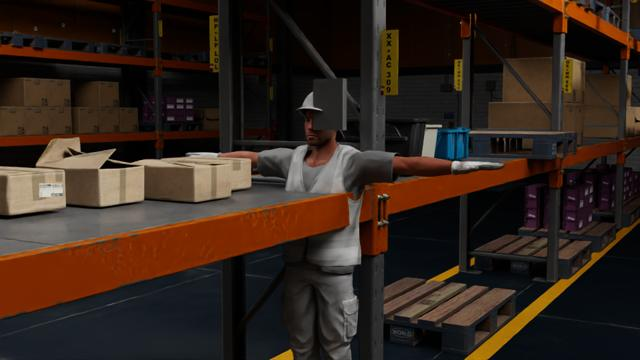

# Physical AI Site Planner

**Camera placement and threat-zone guidance for warehouse safety cameras, built on NVIDIA Omniverse / Isaac Sim physics.**

Innovation Sprint 2026 · Theme: *Physical AI with NVIDIA Omniverse*

---

## The problem

A warehouse installs AI safety cameras to check PPE compliance. Installers mount them wherever is convenient. Floor managers assume coverage is fine. Then a worker in a dim aisle with a partially occluded helmet goes undetected — the exact blind spot simulation would have flagged before a single screw was turned.

## What this is

A **site survey tool** that tells two audiences what to do *before* cameras go live:

- **Installers:** where to mount cameras (position, height, angle) and which placements to avoid
- **Floor managers:** which zones are high-threat (dim lighting, shelf occlusion, no coverage) and what actions to take

Guidance is derived from simulation-measured failure patterns — dim + partial occlusion drops detection recall to 17%; high-angle mounts in occluded zones drop to 24%.

```
warehouse layout → zone lux + occlusion model → threat scoring
  → camera placement recommendations → interactive site planner website
```

## The website

Three views on the SimReady `warehouse_multiple_shelves` floor:

1. **Site Map** — interactive floor plan with threat or luminosity overlays; click any zone for detail
2. **Camera Guide** — six recommended eye-level mounts with height, angle, and coverage zones; one placement flagged as avoid
3. **Threat Board** — ranked high-threat zones with reasons and action cards for floor managers

### Run locally

```bash
# generate zone data (no GPU)
python3 -m crashlab site-plan --out webapp/src/data/site_plan.json

# build the site
cd webapp && npm install && npm run build   # -> webapp/dist/index.html
npm run dev                                 # local dev server
```

### Quick start (backend)

```bash
python3 -m crashlab site-plan    # export camera + threat zone JSON
python3 -m unittest discover -s tests   # 87 unit tests, no GPU
```

## What this prototype does not claim

- Simulation-based guidance supports engineering review; it does not replace on-site surveys or real-world validation.
- Zone lux values are heuristic (distance from window wall + aisle depth), not measured per-cell renders.
- The underlying crash-test lab (helmet detection validation) remains in `crashlab/` for GPU-backed simulation runs.

---

## Original crash-test lab (still in repo)

The repository also contains the full perception validation loop used to derive the threat scores above. See sections below for measured helmet-detection results, Isaac Sim pipeline, and evidence reports.

# Physical AI Crash-Test Lab (validation backend)

**Scenario-driven validation and targeted remediation for physical-AI perception models.**

## What a frame looks like

| bright, helmet worn and visible | dim, helmet partially occluded |
|---|---|
|  |  |

NVIDIA's SimReady warehouse (`warehouse_multiple_shelves.usd`) with the
`male_adult_construction_01` character — the hard hat is the character's own
mesh, labelled and toggled per condition, so the detector is asked about a
genuinely worn helmet. In the right-hand frame a neutral occluder sits on the
camera-to-helmet sightline; the achieved occlusion is measured per frame by the
renderer (`occlusionRatio`), not asserted. The character stands in its rest
pose; conditions vary lighting (scaling all twelve stage lights), camera
distance, elevation, and azimuth per scenario seed.

## Measured results (real, not mocked)

Everything below was produced by this repository running end to end on an
NVIDIA L40S: 2,328 SimReady-warehouse frames rendered, four YOLO11n models
trained, all evaluated on a fingerprint-locked 864-frame test suite
(`aae5a75f676c0b5a9d5cd8d0530ad154`) with 16 frames per condition cell.

### 1. The overall score hides the holes

The baseline detector was trained only on well-lit, unoccluded frames — what a
team gets from filming in a bright aisle. Overall: recall 0.681, precision
0.969, a production-plausible model. Broken down by condition, the analyser
found two blind spots unaided:

| Condition slice | Recall (95% CI) | n |
|---|---|---|
| bright + helmet fully visible | 0.934 [0.86–0.97] | 76 |
| **dim + partially occluded** | **0.165 [0.10–0.26]** | 79 |
| **high camera + partially occluded** | **0.238 [0.16–0.34]** | 84 |

A model that looks signed-off-ready is close to blind exactly where a worker
gets hurt: dark aisles and heads half-hidden behind racking.

### 2. Closing the hole — on the same locked suite

The lab turned the worst finding into a render request (600 frames aimed at
dim + partial, plus one-bucket-adjacent conditions), retrained, and re-ran the
byte-identical suite:

| Slice | Baseline | Candidate | Δ |
|---|---|---|---|
| dim + partially occluded | 0.165 | **0.949** | **+0.785** |
| high camera + partially occluded | 0.238 | 0.869 | +0.631 |
| any partial occlusion | 0.462 | 0.933 | +0.471 |
| overall hard-hat recall | 0.681 | 0.941 | +0.260 |

26 slices improved, 0 regressed, dangerous-miss rate 0.7%, false alarms nearly
halved. Every number carries its sample count; 36 underpowered slices received
no verdict at all.

### 3. The control most demos skip — run twice, with different answers

"0.165 → 0.949" conflates *more data* with *aimed data*, so we ran the
volume-matched control: arm B adds 208 frames sampled from **all** conditions,
arm C adds 208 frames **aimed at the measured weakness** — identical volume
(385 training images each), identical locked suite.

| Arm | dim+partial (n=79) | overall |
|---|---|---|
| A — baseline, easy footage only | 0.165 | 0.681 |
| B — bulk, +208 all-conditions | 0.911 | 0.930 |
| C — targeted, +208 at the weakness | 0.949 | 0.941 |

On this photoreal suite, **coverage is the medicine**: representative bulk
data recovers most of the deficit, and targeting's consistent edge (+0.038 on
the target slice, +0.011 overall) does not clear significance — so the
comparator classifies it *unchanged* rather than claiming a win. On the
earlier primitive-geometry suite (preserved in
[results/v1-primitive/](results/v1-primitive/)), the same experiment found
targeting significantly better (+0.051 overall). That contrast is the product
point: **whether targeted generation is worth paying for is an empirical
question that changes with the domain — and this instrument measures it
instead of assuming it.**

### 4. Evidence, not vibes

Every comparison in this repo:

- runs on a **fingerprint-locked test manifest** — the comparator refuses to run if the suites differ by even one frame;
- reports **sample counts and Wilson 95% CIs** beside every rate;
- **withholds verdicts on underpowered slices** rather than claiming them;
- reports **regressions with the same prominence as wins**;
- records seeds, model hashes, and suite versions so any frame is regenerable.

**Live site — [the whole thing, interactive](https://claude.ai/code/artifact/1a2641ec-1bd2-4944-b121-a4ca7f52cfbe)**
(React + Vite, built from this repo's run artifacts; source in [webapp/](webapp/)).

See also [results/coverage-report.md](results/coverage-report.md) and
[results/fair-control-report.md](results/fair-control-report.md). Two
standalone views are generated straight from the run's artifacts:

- **[demo/index.html](demo/index.html) — the Crash-Test Explorer.** Pick a
  condition cell, see a real frame from the locked suite, and flip between
  baseline and candidate to watch their actual detections drawn over the
  image (keyboard: `b` / `c` / `n`). The dim + occluded cell is the one to try.
- **[dashboard/index.html](dashboard/index.html) — the evidence dashboard.**
  Four screens (suite, failure map, remediation, comparison) with the
  heatmap, ranked weak slices, dumbbells, and the volume-matched control.

## How it works

| Stage | Module | Runs on |
|---|---|---|
| Zone grid, threat scoring, camera placement | `crashlab/site_planner.py` | anywhere |
| Export site plan JSON | `python3 -m crashlab site-plan` | anywhere |
| Declare condition matrix (lux, metres, degrees — physical units) | `crashlab/schema.py` | anywhere |
| Build suite, locked stratified train/test split | `crashlab/suite.py` | anywhere |
| Render frames + perfect labels + measured occlusion | `crashlab/generator/` | Isaac Sim |
| Train / run the detector (YOLO11n) | `crashlab/detector/` | GPU |
| Match boxes, score by condition, rank weak clusters | `crashlab/matching.py`, `metrics.py`, `analysis.py` | anywhere |
| Compare on locked suite, emit evidence report | `crashlab/compare.py`, `report.py` | anywhere |
| Orchestrate | `crashlab/pipeline.py`, `full_loop.sh` | anywhere |

Deliberate split: **the analysis half is pure Python stdlib** — no torch, no omni — so it runs identically on a laptop, in CI, and inside Isaac Sim's bundled interpreter. 79 unit tests. The GPU half hands over plain JSON.

Ground truth is free and perfect: the simulator *placed* the helmet, so it knows the exact box — and Replicator's `occlusionRatio` means "partially occluded" is **measured per frame**, not asserted.

### The site

```bash
cd webapp && npm install && npm run build   # -> webapp/dist/index.html, self-contained
npm run dev                                 # local dev server
```

Run data is baked in from `webapp/src/data/` (exported from a real run), so the
build has no network dependency and the page works offline.

### Quick start

```bash
# no GPU needed — full loop on synthetic fixtures (also the stage-demo fallback)
python3 -m crashlab demo

# tests
python3 -m unittest discover -s tests

# with Isaac Sim (tested on 6.0.1, L40S):
python3 -m crashlab build-suite --out artifacts
/path/to/isaac-sim/python.sh -m crashlab.generator.generate \
    --manifest artifacts/warehouse_ppe_v1-test.json --out datasets/test
./full_loop.sh baseline && ./full_loop.sh candidate
```

## What this prototype does not claim

- It does **not** certify safety; simulated coverage does not prove real-world performance, and the synthetic-to-real gap is stated, not quantified.
- The worker character stands in a static rest pose; motion, pose variety and multiple workers are untested. `visible`-bucket frames can still carry incidental self-occlusion from the wearer's own head — measured and recorded per frame rather than assumed away. Absolute numbers won't transfer to reality; **comparisons between model versions on the same suite** are the meaningful output.
- Lighting buckets map to uncalibrated simulator intensity; ordering is meaningful, lux values are nominal.
- Ultralytics YOLO is AGPL-3.0 — fine for a prototype, to be replaced (e.g. NVIDIA TAO) for productization.

## Market

Manufacturers, warehouse/logistics operators, robotics and industrial CV teams; buyers in operations, EHS, automation, AI engineering. Presidio GTM: physical-AI readiness assessment → Omniverse environment build, synthetic-data engineering, NVIDIA infrastructure, MLOps integration → recurring managed validation, where every model release is crash-tested before deployment.

Automotive safety has crash-test institutions that buyers, insurers, and regulators trust. Physical AI — operating around human workers daily — has nothing comparable. That is the product.

## Repository map

```
webapp/              Site Planner website (React + Vite, single-file build)
crashlab/            the library (site_planner, schema, suite, metrics, analysis, compare, report)
crashlab/site_planner.py  zone threat scoring + camera placement (no GPU)
crashlab/generator/  Isaac Sim / Replicator rendering
crashlab/detector/   YOLO training + inference (only part importing torch)
tests/               87 unit tests, no GPU required
results/             evidence reports from the real end-to-end runs
dashboard/           self-contained run dashboard (open in any browser)
ops/                 AWS instance helpers (parameterised; see ops/env.example)
PLAN.md              full product/research/build plan
```
