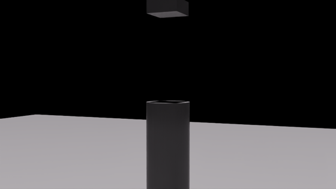
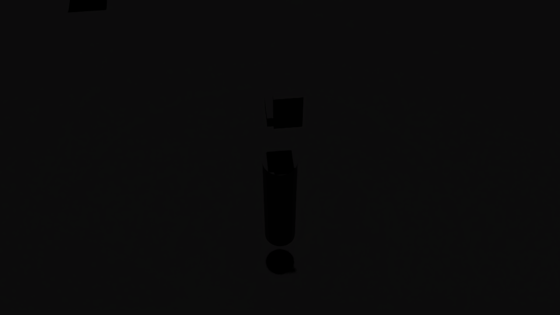

# Physical AI Crash-Test Lab

**Scenario-driven validation and targeted remediation for physical-AI perception models, built on NVIDIA Omniverse / Isaac Sim / Replicator.**

Innovation Sprint 2026 · Theme: *Physical AI with NVIDIA Omniverse*

---

## The problem

A warehouse installs an AI camera that checks whether workers wear hard hats. It scores well in testing and gets signed off. Then it misses a worker in a dim corner whose helmet is half-hidden behind a pallet — the exact situation where someone gets hurt, and the exact situation nobody staged during testing, because staging dangerous conditions is slow, expensive, and sometimes unsafe.

Synthetic data generation is supposed to fill this gap, but volume alone answers none of the questions that matter:

- **Where exactly** is the model weak?
- **Which data** would fix that specific weakness?
- Did the new model **actually improve — and what did it break?**

## What this is

A crash-test lab for perception models. Car makers don't wait for real accidents; they crash cars deliberately, in controlled conditions, and publish the evidence. We do the same for AI vision:

```
declare conditions → render controlled scenes (labels come free)
   → evaluate → score BY CONDITION → find the hidden hole
   → generate data aimed at that hole → retrain
   → re-test on the SAME locked suite → versioned evidence report
```

## What a frame looks like

| bright + fully visible | dim + partially occluded |
|---|---|
|  |  |

Same scene, two declared conditions — the right-hand frame is what the baseline model is blind in. Geometry is deliberately primitive proxy shapes (a cylinder worker, a cube hard hat — the hat hovers due to a known scale quirk, disclosed in limitations): the lab measures detection under controlled physical conditions, and the ground truth is exact regardless of visual fidelity. Swapping in SimReady warehouse assets changes the art, not the method.

## Measured results (real, not mocked)

Everything below was produced by this repository running end-to-end on an NVIDIA L40S: 2,220 rendered frames, four real YOLO11n models trained and evaluated on a fingerprint-locked 540-frame test suite.

### 1. The overall score hides the hole

We trained a baseline detector only on well-lit, unoccluded frames — what a real team gets from filming in a bright aisle. Overall hard-hat recall: **0.449**. Broken down by condition, the analyser found — without being told what was withheld from training:

| Condition slice | Recall (95% CI) | n |
|---|---|---|
| bright + fully visible | 0.983 [0.91–1.00] | 60 |
| **dim + partially occluded** | **0.034 [0.01–0.12]** | 59 |

A signed-off-looking model that is functionally blind in the condition most likely to hurt someone.

### 2. Closing the hole — and the experiment most demos skip

The naive claim would be "remediation took 0.034 → 0.932." That conflates *more data* with *aimed data*. So we ran the volume-matched control:

| Arm | Training set (identical volume where marked) | dim+partial recall |
|---|---|---|
| A — baseline | 195 easy frames | 0.034 |
| B — bulk | *403 frames: easy + 250 sampled from ALL conditions | 0.847 |
| C — targeted | *403 frames: easy + 250 aimed at the measured weakness | **0.932** |

Findings, stated honestly:

- **Most of the gain comes from covering hard conditions at all** (A→B: +0.813).
- **Targeting adds a real, statistically significant refinement** at equal volume: overall +0.051 (significant), occluded-helmet slice +0.107 (significant), the exact target cell +0.085 (inconclusive at n=59 — our own tooling refuses to call it, and says so).

The product's value is **discovery and evidence**: it found a 3.4%-recall blind spot nobody knew existed, told us which data addresses it, and proved the outcome on an untouched suite — including what the fix did *not* improve.

### 3. Evidence, not vibes

Every comparison in this repo:

- runs on a **fingerprint-locked test manifest** — the comparator refuses to run if the suites differ by even one frame;
- reports **sample counts and Wilson 95% CIs** beside every rate;
- **withholds verdicts on underpowered slices** rather than claiming them;
- reports **regressions with the same prominence as wins**;
- records seeds, model hashes, and suite versions so any frame is regenerable.

See [results/coverage-report.md](results/coverage-report.md) and [results/fair-control-report.md](results/fair-control-report.md).

## How it works

| Stage | Module | Runs on |
|---|---|---|
| Declare condition matrix (lux, metres, degrees — physical units) | `crashlab/schema.py` | anywhere |
| Build suite, locked stratified train/test split | `crashlab/suite.py` | anywhere |
| Render frames + perfect labels + measured occlusion | `crashlab/generator/` | Isaac Sim |
| Train / run the detector (YOLO11n) | `crashlab/detector/` | GPU |
| Match boxes, score by condition, rank weak clusters | `crashlab/matching.py`, `metrics.py`, `analysis.py` | anywhere |
| Compare on locked suite, emit evidence report | `crashlab/compare.py`, `report.py` | anywhere |
| Orchestrate | `crashlab/pipeline.py`, `full_loop.sh` | anywhere |

Deliberate split: **the analysis half is pure Python stdlib** — no torch, no omni — so it runs identically on a laptop, in CI, and inside Isaac Sim's bundled interpreter. 79 unit tests. The GPU half hands over plain JSON.

Ground truth is free and perfect: the simulator *placed* the helmet, so it knows the exact box — and Replicator's `occlusionRatio` means "partially occluded" is **measured per frame**, not asserted.

### Quick start

```bash
# no GPU needed — full loop on synthetic fixtures (also the stage-demo fallback)
python3 -m crashlab demo

# tests
python3 -m unittest discover -s tests

# with Isaac Sim (tested on 6.0.1, L40S):
python3 -m crashlab build-suite --out artifacts
/path/to/isaac-sim/python.sh -m crashlab.generator.generate \
    --manifest artifacts/warehouse_ppe_v1-test.json --out datasets/test
./full_loop.sh baseline && ./full_loop.sh candidate
```

## What this prototype does not claim

- It does **not** certify safety; simulated coverage does not prove real-world performance, and the synthetic-to-real gap is stated, not quantified.
- Scene geometry is primitive stand-ins (cylinder worker, cube hat; a scale quirk leaves the hat floating above the worker — consistent across every frame and both models, so comparisons hold). Absolute numbers won't transfer to reality; **comparisons between model versions on the same suite** are the meaningful output.
- Lighting buckets map to uncalibrated simulator intensity; ordering is meaningful, lux values are nominal.
- Ultralytics YOLO is AGPL-3.0 — fine for a prototype, to be replaced (e.g. NVIDIA TAO) for productization.

## Market

Manufacturers, warehouse/logistics operators, robotics and industrial CV teams; buyers in operations, EHS, automation, AI engineering. Presidio GTM: physical-AI readiness assessment → Omniverse environment build, synthetic-data engineering, NVIDIA infrastructure, MLOps integration → recurring managed validation, where every model release is crash-tested before deployment.

Automotive safety has crash-test institutions that buyers, insurers, and regulators trust. Physical AI — operating around human workers daily — has nothing comparable. That is the product.

## Repository map

```
crashlab/            the library (schema, suite, metrics, analysis, compare, report)
crashlab/generator/  Isaac Sim / Replicator rendering
crashlab/detector/   YOLO training + inference (only part importing torch)
tests/               79 unit tests, no GPU required
results/             evidence reports from the real end-to-end runs
ops/                 AWS instance helpers (parameterised; see ops/env.example)
PLAN.md              full product/research/build plan
```
